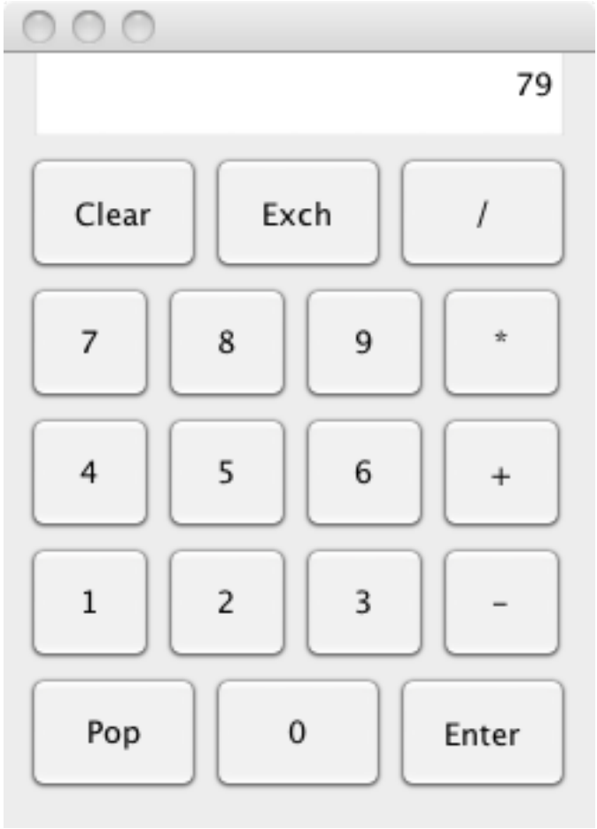

# Assignment 03 - Calculators

## Learning Goals

* Gain practice using the Stack data structure.
* Implement an `ActionListener`.
* Gain more practice with Java GUIs and events.
* Gain more experience with unit testing

## Key Terms and Concepts

* Stacks - A data structure like a stack of plates where only the top element can be modified, either by peeking at it, removing it, or adding another element on top of it (See 1.3 pg. 127 in the textbook and the lecture slides)
* ActionListener - An interface that allows for the creation of objects that respond to user input and produce a signal (See https://docs.oracle.com/javase/7/docs/api/java/awt/event/ActionListener.html for Java documentation)
* Postfix Notation - A form of mathematical notation where the operator comes after the operands, e.g. 3 5 + instead of 3 + 5. See **Appendix A - Postfix Notation** for more on postfix notation and the lecture slides.

## Description

Your next program is to implement a postfix calculator application which takes input in postfix notation and displays the results of the computation. You will make sure all the buttons work properly and add your own function to the calculator.

Let's look at a few examples of evaluating postfix expressions using your calculator. To evaluate the postfix
expression `5 3 +` (which is `3+5` in normal infix notation), click on `3`, `enter`, `5`, `+`. The `enter` button is
used to signal the end of a number being input. Without the `enter`, we would not know whether the user was
inputting the number `3` or the number `35`. The user can also click on an operator button to signal the end
of a number being input. Notice that in our example the user clicked the `enter` button only after the digit `3`.
After the digit `5`, the user clicked the `+` button. When we see the `+` button, we know the user has finished
entering a number and we can now add those numbers together. The answer should then be displayed.

## Classes

There are four classes for this project: `Calculator`, `State`, `DigitButtonListener`, and `OpButtonListener`,
where the last three implement the `ActionListener` interface. Of these four classes, you are expected to
complete the `DigitButtonListener` class and the `State` class.
Once you have both of these classes working properly, you must add one or more new
buttons to the calculator.
Possibilities include a squaring button, factorial, or x^y. You should add the new button so that it looks
nice, add an appropriate listener (created from `OpButtonListener` if you like), and make sure that the state
knows how to handle that operation.

### `Calculator`

We have provided you with the code for the main `Calculator` class. This class handles the layout of the buttons.
We have also provided listeners for the `clear`, `pop`, and `enter` buttons. Recall that `listeners` for `JButtons`
consists of an object from a class that implements `ActionListener`, where `ActionListener` is an interface
with only one method, `actionPerformed(ActionEvent evt)`.

### `OpButtonListener`
The listeners for operation buttons (plus, times, etc.) are more complicated, so it is easiest to write out the
full listener class.

The `OpButtonListener` is a listener class for the operation buttons: `+`, `-`, `*`, `/`. When a listener is set up
for one of these operations, the listener takes as a parameter the operation that it is responding to so that
it knows what operation to respond to. When the button is pressed, the listener sends a `doOp` to `calcState`
with a string representing the operation to be performed. The state should then pop the top two elements
off of the stack, perform the operation on them (make sure you get the order of the operands correct) and
then push the answer back on the stack.

Read through the `OpButtonListener` class until you are confident that you understand how it operates.
This class provides a useful example for you when you are implementing the `DigitButtonListener` class.

### `DigitButtonListener`
This class contains the code to be executed when the user clicks on a digit button. Make sure you understand
how the `DigitButtonListeners` are being used in the `Calculator` class. Each digit key has its own specialized
`DigitButtonListener` which is responsible for knowing which number key it is listening to. When a button
is clicked, the code in the `actionPerformed()` method is executed. This methods should inform the state
what digit has been clicked on so that the state can use the digit to build the number being typed in. Use `OpButtonListener` to inform how you write this class.

### `State`
A `State` class represents the memory of the calculator. You may think of it as representing the printed
circuit and memory in the calculator. Its purpose is to keep track of the current state of the computation.
For instance, it has to keep track of whether the user is entering a number, and what the number is so far. It
must also keep track of the display window of the calculator (a `JTextField` that displays the current state
of the calculator).

The most important feature of the `State` is its stack, which represents those numbers stored on the
calculator. We will use the `Deque` class in the `java.util` package.

Let's look at how you would evaluate the example from earlier (`3`, `enter`, `5`, `+`). First, you must keep track
of the number being constructed. When the `enter` button is clicked, you know this number is complete. We
would then push the number, `3`, onto the stack. The next number is a `5`. We would push this number onto
the stack as well. Finally, since the user clicks `+` we would pop the two numbers off the stack, add them to
get 8, and then push 8 back onto the stack.

See **Appendix B - Calculator Specifics** for more on what each button should do and how your calculator should operate. Read through this carefully.

### `StateTest`
`StateTest` is a `JUnit` test class for the `State` class. It is partially written for you. You must finish writing
unit tests for the remaining methods i.e. you must fill in the unit tests for the methods that are not yet
implemented. Feel free to add additional unit tests to the `StateTest` class to test individual methods more rigorously for edge cases.

## Getting started

1. Follow the same steps with the first lab/assignment to clone the github repository for this assignment.

2. Read through the provided classes to get a sense of how this program fits together.

3. Begin working on the `DigitButtonListener` based on the provided classes. Make sure that this code communicates with the other classes effectively.

4. Move on to the `State` class, which contains the brunt of the work for this assignment. Make sure that your code complies with all the guidelines in **Appendix B - Calculator Specifics**.

5. Implement your own operation. Possibilities include a squaring button, factorial, or x^y. You should add the new button so that it looks
nice by modifying the button layout code in the `Calculator` class, add an appropriate listener (created from `OpButtonListener` if you like), and make sure that the state
knows how to handle that operation.

6. Make sure you fill out the assignment.json file with **your name** and a description of **extra credit**.

## Helpful Considerations
* Stack & Postfix - As you might have noticed, the stack data structure works nicely with postfix notation, as you can take elements off the top and use them after an operation is called to the calculator. Why is a stack especially helpful here? Where else in programming might a stack be useful? What are the potential limitations of using a stack here?
* Additional features - Which features and operations would be most simple to implement in this calculator? Which might be more complex? Why is this? For instance, consider that operations which can work on a single element carry their own set of special circumstances.
* Listeners - How are listeners used in this project? Why are they helpful overall?

## Grading

You will be graded based on the following criteria:

| Criterion                                | Points |
| :--------------------------------------- | :----- |
| `JUnit` tests for each method in `State` | 3      |
| Digits and `enter` handled appropriately | 3      |
| Arithmetic operations handled appropriately | 3      |
| Appropriately handle errors and show message | 2     |
| Misc keys handled correctly                  | 3      |
| Digit listener                           | 2      |
| Extra method/calculator functionality    | 2      |
| Appropriate comments + JavaDoc           | 3      |
| [Style and formatting](https://github.com/pomonacs622018f/Handouts/blob/master/style_guide.md)                       | 2      |
| Submitted correctly                      | 1      |
| Extra Credit                             | 2      |

NOTE: Code that does not compile will not be accepted! Make sure that your code compiles before submitting it.

## Submitting your work

 Double-check that your work is indeed pushed in Github! It is your responsibility to ensure that you do so before the deadline. Don't forget to commit and push your changes as you go and to edit the provided `json`. In particular, don't forget to add a description of your extra credit if you completed it. 

## Extra credit

If you are interested in extra credit, we suggest that you add a decimal point button so that your calculator
can handle floating point numbers. Be sure to check that the user does not input an illegal number (e.g., with two decimal points). Possibilities for new buttons with this include square root, trig functions (e.g.,
sin, cos, tan, etc.), inverse trig functions, x^y, e^x, factorial,  inverses, or logarithms.

See the `Math` class in package `java.lang` for a list of available mathematical functions in Java. Make
sure the basic functions of your calculator are working correctly before moving on to extra credit. Please set the `ec` field in your `json` file to true so that
we can look out for that.

### Appendix A - Postfix

In postfix notation, the operator comes after the operands. For example, the expression `3 + 5` would be
written as `3 5 +`. As another example, the expression `52 - (5 + 7) * 4` would be written as:

    52 5 7 + 4 * -

Here is another example. To calculate `3+5*7` (which is written `3 5 7 * +` in postfix notation), click on
`3`, `enter`, `5`, `enter`, `7`, `*`, `+`. Again, note that the only thing clicking `enter` does is to signal the end of
the number being input.)

### Appendix B - Calculator Specifics

* If the stack is empty, the display should show `0`.  Otherwise, unless a number is being entered, the display should show the number on the top of stack.
* If the `enter` button is clicked, the current number being constructed is complete. This new number is stored on top of the stack with any previous numbers sitting below.
* If an operator button is clicked, and there are at least two elements on the stack, then the top two
elements are popped off, the operation is performed, and the answer is pushed back on top of the stack.
Make sure that you perform the operation on the numbers in the correct order!
If the user makes a mistake, e.g., dividing by 0 or trying to perform an operation when there are fewer
than two elements on the stack, then the display should show `Error` and the calculator should be reset. You can detect divide by zero yourself or let the system throw an `ArithmeticException` when a divide
by zero occurs. Either way, you must handle the error (i.e., your program should not crash and no
ugly red stuff) and have the display show `Error`.
* If the `clear` button is clicked, the calculator is cleared and reset.
* If the `pop` button is clicked, and you are currently building a number, then that number should be
thrown away. Otherwise, if the `pop` button is clicked, then the top element of the stack should be
popped and thrown away. The calculator display should be updated to show the new top element of
the stack (or zero if the stack is empty). It is not considered an error if the user pushes the pop button
when there is nothing on the stack. Just ignore the event.
* If the `exch` button is clicked, you should exchange the top two elements of the stack. It is not considered
an error if the user clicks the exch button and there are fewer then two elements on the stack. Just
ignore the key press.
* You might find it easier to write the code first under the assumption that the user must push the `enter` button after punching in each number. However, for full credit, it should also handle the
case where the user punches in a number followed immediately by an operation. The result should
be equivalent to sticking in an intervening `enter`. That is punching in `5`, `enter`, `7`, `+` should give
the same results as `5`, `enter`, `7`, `enter`, `+`. (Think about what pressing the `enter` key actually does.
What is the difference between pressing `3` `7` and `3` `Enter` `7`? It makes a difference.)
