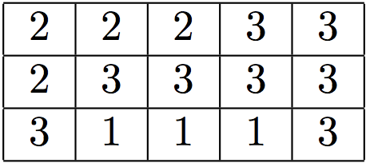
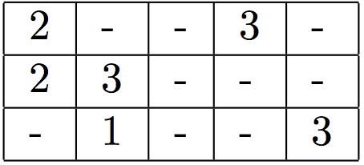
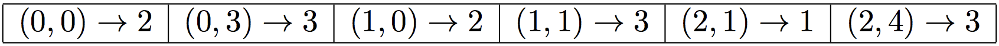
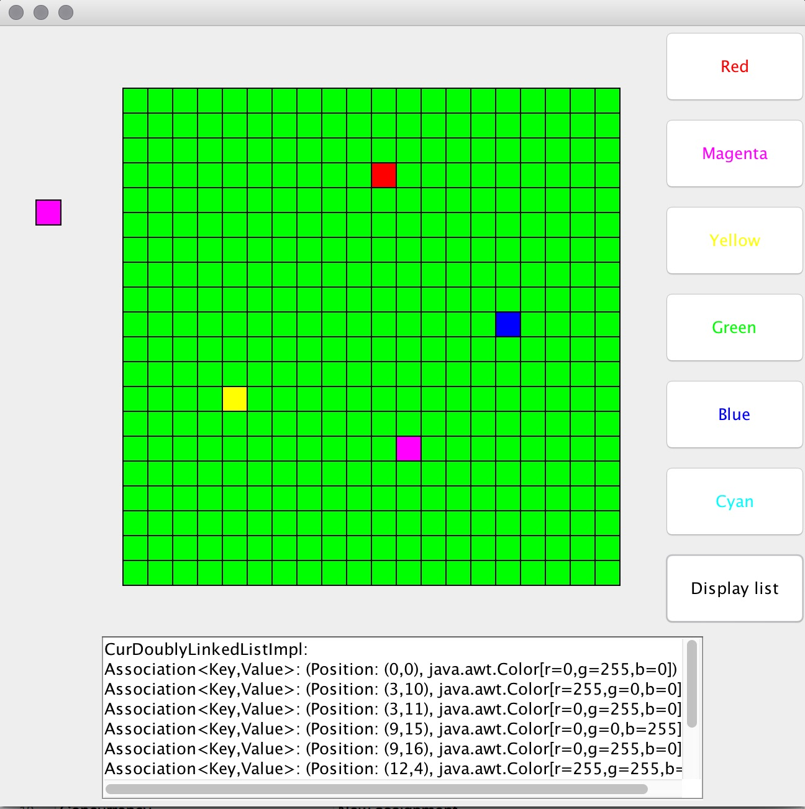
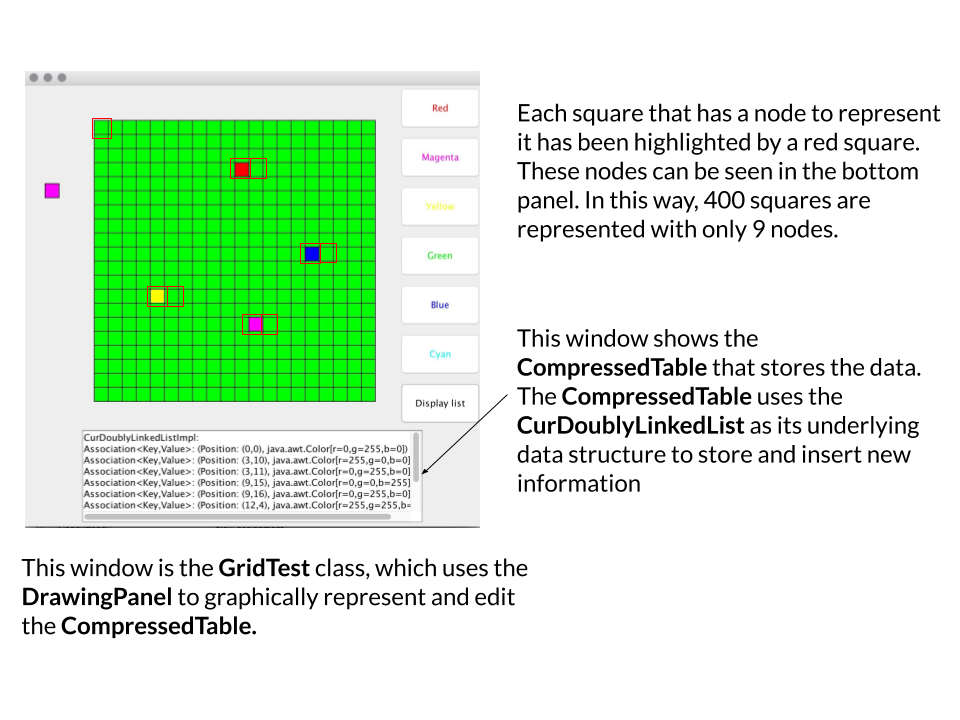
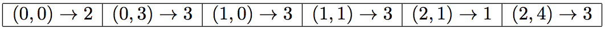
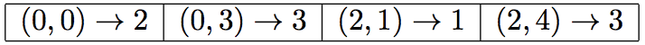

# Assignment 04 - Compression

## Learning Goals

* Practice inheritance by extending and using a doubly linked list data structure.
* Gain experience designing and implementing a non-trivial algorithm.
* Gain experience debugging complex and troublesome code.
* Gain even more experience using `JUnit`.

## Key Terms and Concepts

* `DoublyLinkedList` - A list consisting of nodes that each contain an item and a pointer to the node ahead and behind them. This means the list has minimal structure and instead consists of individual elements strung together. Please *review* the `DoublyLinkedList.java` file we have provided you with as we have added two useful methods. Being familiar with this class will ensure that you don't duplicate work in its subclass `CurDoublyLinkedList`.
* `Association` - A data structure containing a key and a value together. This allows for two pieces of data to be "associated" and referenced together, and can be useful for storing certain information in a dictionary. We have provided an `Association.java` file for your convenience. Please review it.
* Compression - A very useful technique where large amounts of data is efficiently stored to reduce the space it takes up, through encoding or other methods. (See 5.5 pg. 810 in the textbook and **Appendix A - Compression** for more)

## Description

In this assignment, you will create a program that efficiently stores information about blocks of colors. The basic idea of our encoding will be to represent a block of pixels with the same color by simply
recording the first place where we encounter the new color and only recording information when we see a
new color. For instance, suppose we have the following table of information (where we will imagine each
number represents a color):

If we imagine tracing through the table from left to right starting with the top row and going through
successive rows then we notice that we only need to record the following entries:

Rather than recording this in a two-dimensional table, it will now generally be more efficient to keep this
information in a linear list of `Assocations` where it is assumed we sweep across an entire row before going
on to the next:

This assignment asks you to apply this technique to a drawing program, where individual pixels can be changed. The program should act like you would expect a drawing program to, but it will store the information in one of these tables.

## Classes

This assignment has many classes. You are responsible for `CurDoublyLinkedList` and `CompressedTable`. The first of these is the underlying data structure, a doubly linked list that includes a pointer, and the second is the class which handles the updating of the grid. You are also responsible for testing `CurDoublyLinkedList` with JUnit tests. The other classes have all been implemented for you.

### `RowOrderedPosn`

The `RowOrderedPosn` class represents a single entry in a row-ordered table. The constructor takes four
parameters: the row of the entry in the table, the column of the entry in the table, the total number of rows
in the table, and the total number of cols in the table. Thus,

    new RowOrderedPosn(0, 0, 5, 3)

represents the entry at location (0, 0) i.e. the upper-left corner in a table with 5 rows and 3 columns. This
class also contains methods to return the next position after a given one and to compare two positions in a
table. This class is already implemented for you.

### `DrawingPanel`

This class is responsible for displaying the two-dimensional grid of colored rectangles. It is also responsible
for any mouse actions performed on the two-dimensional grid. This class is already implemented for you.

### `GridTest`

This class creates an applet that lets the user manipulate a grid of rectangles that form an image. The user interacts with the application by clicking on a color button to set the current color and then clicking
on rectangles in the grid to change the colors of individual rectangles. Along with the color buttons there is a button that will display the results of sending the toString method to the object of type
`CompressedTable` to show the current state of the representation. This can help you as you attempt to
debug your `CurDoublyLinkedList` and `CompressedTable` classes. This class is already implemented for
you.

### `TwoDTable`
This interface represents a two-dimensional table.

### `CurDoublyLinkedList`

`CurDoublyLinkedList` (short for 'extends the `DoublyLinkedList` class to include a current pointer).  Think carefully about what it means for one class to extend another.
The `CurDoublyLinkedList` class should support all of the old methods. In addition, 
the new class should support the following methods:

* `first()`, `last()`,
* `next()`, `back()`,
* `isOffRight()`, `isOffLeft()`,
* `currentValue()`,
* `addAfterCurrent(Object value)`, and `deleteCurrent()`.

Specifications for these methods can be found in the startup code available on-line. You should start this
assignment by finishing the `CurDoublyLinkedList` class.

### `TestCurDoublyLinkedList`

This is a **`JUnit`** test class for the `CurDoublyLinkedList` class. There are already a few tests provided for you.
You must finish this class by adding at least one test for each method in the `CurDoublyLinkedList` class.
The more thorough your tests, the easier time you will have when you implement the `CompressedTable`
class. Be sure to test all of the *edge* (special) cases.

### `CompressedTable`

The `CompressedTable` class represents the compressed table. `CompressedTable` implements the `TwoDTable`
interface. It has an instance variable `tableInfo` of type:
`CurDoublyLinkedList<Association<RowOrderedPosn, ValueType>>`. The instance variable `tableInfo` is a `CurDoublyLinkedList` where each node in the list is an `Association`
whose key is an entry in the table of type `RowOrderedPosn` and whose value is of type `ValueType`. Feel free
to add other instance variables to this class.
You must fill in the constructor for the `CompressedTable` class as well as the two methods:
* `updateInfo(row,col,newInfo)`
* `getInfo(row,col)`

The `updateInfo` method of `CompressedTable` is probably the trickiest code to write. Here is a brief
outline of the logic:

1. We have provided you with code to find the node of the list that encodes the position being updated.
Of course not every position is in the list, only those representing changes to the array. If the node is
not there, the method returns the node before the given position in the list. The class `RowOrderedPosn`
(see the startup code) not only encodes a position, but, because it also contains information on the
number of rows and columns in the table, can determine if one position would come before or after
another.

2. If the new information in the table is the same as that in the node found in step 1, then nothing needs
to be done. Otherwise determine if the node represents exactly the position being updated.
If it is the same, update the value of the node, otherwise add a new node representing the new position.

3. If you are not careful you may accidentally change several positions in the table to the new value. Avoid
this by considering putting in a new node representing the position immediately after the position with
the new value. (Why? Draw pictures of the list so you can see what is happening!)

4. If there is already a node with this successor position then nothing needs to be done. Otherwise add a
new node with the successor position and the original value. (Do you see why this is necessary? Look
at the demo program to see why.)

Try to draw examples of this logic with several sample lists so that you can understand how it works!

## Getting started

1. Follow the same steps with the first lab/assignment to clone the github repository for this assignment.

2. Read through this writeup completely before you start. Then, get a sheet of paper and pencil and
draw pictures to help you understand how the doubly linked list works and how the compressed table
should work. These examples can also help you form your unit tests. Don’t forget to think about
special cases.

3. After reading the writeup and going through examples, start working on the design of the program.
How will you keep track of whether current is off the right or left side of the list? Look out for methods
that you can implement in terms of the other existing methods in either the `CurDoublyLinkedList` or
`DoublyLinkedList` class.

4. Try to interweave testing your code and writing your code. It is much better to write a method and
then stop and test it instead of writing all of the code for a class and only afterwards testing. Even
better is to write all of your test in `JUnit` before you write the code and then slowly turn the red to
green!

5. Make sure you fill out the assignment.json file with **your name** and a description of **extra credit**.

## Helpful Considerations

* Bug hunting - This is a complex project where many things can go wrong. It is more likely than not that there will be large bugs, even late into the project. Try to identify where these bugs are coming from - often, there is an issue with `CurDoublyLinkedList` that is causing them but it is difficult to see as you are working on an entirely different piece. How can we test incrementally to try to stop these bugs from occurring? What's a good way to identify the source of a problem?

* Understanding what's given - As in the other projects, a significant amount of code has been provided to you. Try to go through it and understand how it can help you, and through this isolate what you need to focus on. After `CurDoublyLinkedList`, there is really only a couple more methods for you to implement. How can the provided classes and methods help you write these? In particular, we recommend looking at the `find` method in `CompressedTable` and the methods in `RowOrderedPosn`.

* Why a linked list? - This assignment is a great example of how data structures like LinkedLists can be helpful in the real world. What are the advantages of a DoublyLinkedList in this scenario? Why would this project not work with an ArrayList? What are some other potential applications of LinkedLists?

## Grading

You will be graded based on the following criteria:

| Criterion                                | Points |
| :--------------------------------------- | :----- |
| No change if new color same as current   | 1      |
| Change color of position already in list | 2      |
| Change color of position not in list     | 2      |
| Correctly adds second node to list when needed | 2      |
| `CurDoublyLinkedList`                    | 4      |
| JUnit tests for all methods in `CurDoublyLinkedList` | 2      |
| Appropriate comments (including JavaDoc) | 2      |
| General correctness                      | 2      |
| [Style and formatting](https://github.com/pomonacs622018f/Handouts/blob/master/style_guide.md)                      | 2      |
| Submitted correctly                      | 1      |
| **Total**                                | **20** |
| Extra Credit - efficiency                | 2      |

NOTE: Code that does not compile will not be accepted! Make sure that your code compiles before submitting it.

## Submitting your work

 Double-check that your work is indeed pushed in Github! It is your responsibility to ensure that you do so before the deadline. Don't forget to commit and push your changes as you go and to edit the provided `json`. In particular, don't forget to add a description of your extra credit if you completed it.

## Extra credit

As you add more information to the table, you will notice that the table is no longer as efficient in space, because several consecutive entries may have the same values. Make the representation more efficient by dropping later values if they can be subsumed by earlier ones.

For example, the list

can be replaced by the much simpler list:

For extra credit, modify the `updateInfo` method of `CompressedTable` to eliminate consecutive items
with the same value. The amount of extra credit received will be proportional to the efficiency of your
algorithm. Ideally this optimization will only take `O(1)` time each time something is inserted in the table.

### Appendix A - compression

Sometimes we need to store massive amounts of information about an object. A good example is storing
graphic images. To save space on disks and in transmission of information across the internet, researchers
have designed algorithms to compress data. In this assignment, you will learn one of these compression
techniques.

A graphic image can be represented by a two dimensional array of information about the colors of various
picture elements (or pixels). At high resolution, the image may be composed of 1000 rows and 1000 columns
of information, leading to the need to store information on 1,000,000 pixels per image. Needless to say this
creates serious problems for storing and transmitting these images. However most images tend to have many
contiguous groups of pixels, each of which are the same color. We can take advantage of this by trying to
encode information about the entire block in a relatively efficient manner.

We have provided you with a lot of code here, but you will find that much of the code you must write is
quite tricky. This project will require you to be very careful in developing the code for the methods. Look
carefully at the provided code and design your methods very carefully. In particular, be sure to test your
code carefully as it is developed as you will likely make several logical errors if you are not extremely careful.
This is your most complex program yet. You should start early on this assignment and make a very
complete design for your program before you ever sit down at the computer to program.
