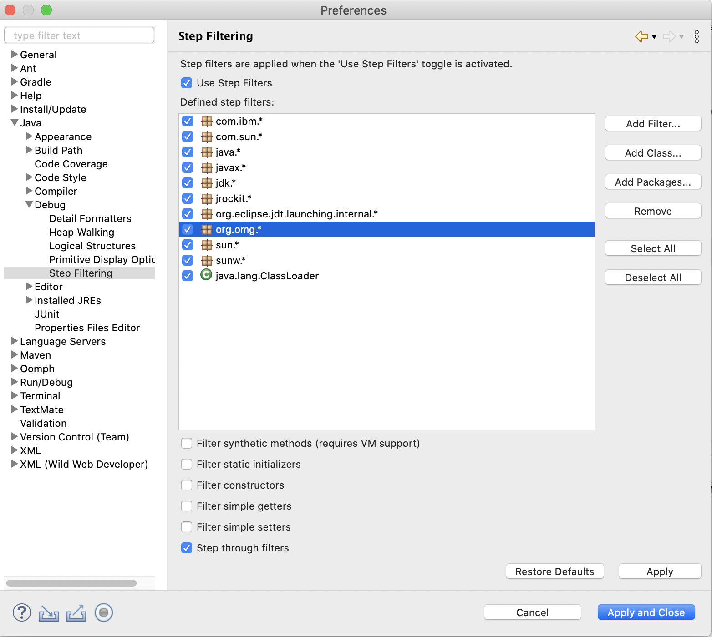
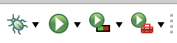
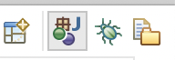

# Lab - Debuggin

## Learning Goals

* Practice debugging programs.
* Learn to use the debugger in Eclipse.

## The Debugger

So far, when something has been wrong with your code, chances are you relied on interpreting any error messages in the console and trying to incorporate print statements throughout your code to see where the bug(s) have occurred. Today, we will learn how to use a powerful tool that will make your lives much easier: the debugger. The debugger is a tool that allows us to more flexibly and insightfully debug our programs. Eclipse, being an IDE (integrated development environment) has a debugger that we will learn how to use today.

To demonstrate the debugger, we will use two classes, `Fraction` and `FractionTester` and we will have a live demo on the different Debugger features that you will find handy. The `Fraction` class represents the mathematical concept of a fraction and the `FractionTester` has our `main` method. Familiarize yourself with both classes and eventually go to `FractionTester`.

Before we proceed with debugging our program, we want you to navigate to Eclipse's properties and check the following options so that you don't unnecessarily end up debugging code written by Java language developers instead of you:

Rather than clicking the `Run` button (green circle with a play icon in it), we will click on the button to its left that looks like a...bug. If you hover over it, you will see a tooltip having the message `Debug FractionTester`.

This action will immediately take you to the Debug view. Make sure that once you are done with debugging, you go back to Java view.

We will place a breakpoint (where we want to stop the execution of our code to slowly evaluate if things unfold as we are expecting) on line 12 by double-clicking it. If you want to remove a breakpoint, right click and `disable breakpoint` or just double click it again.

We will go together over the buttons below that will allow us to step over, into and return. 

The summary is:

- *Step over*: This command lets the application execute the next action. If the action involves a call to an operation, it does not step into its implementation (it steps over it instead).
- *Step into*: This command lets the application execute the next action. If the action involves a call to an operation, it steps into its implementation and breaks the execution on the first action of that implementation.
- *Return*: Think of it as the opposite of step into.

As we evaluate things, we will find handy the tab `variables`. You might also want to select `Window`>`Show view`>`expressions` where you can write statements (e.g, a boon statement) and evaluate them in real-time.

That's it! You now are ready for debugging things on your own. 

## Your Goal

A matrix is a two dimensional structure where you can index an element based on its row and column.  For the assignment, we've provided you with a class called Matrix that implements this using an ArrayList of ArrayLists.  For this lab, we have generated three versions of this class, each of which doesn't quite work correctly.  Your goal is to try and correct each of the implementations so that they work correctly.  You should debug them in the following order:

* BadMatrix
* BadMatrix2
* BadMatrix3

Each of these implementation has one main bug that's prevenging it from working correctly.  To help you in narrowing down where the issue is (and to give you examples of how you can write test cases), we have provided a Test class with some static test cases.  To make our life simpler, all three "Bad" implementations inherit from Matrix (though they override all the methods), so the two main tests will work on any of the Matrix classes.

## When you're done

When you've found and fixed the bugs in the three matrices, push your fixed versions to github as you have done in past labs.
