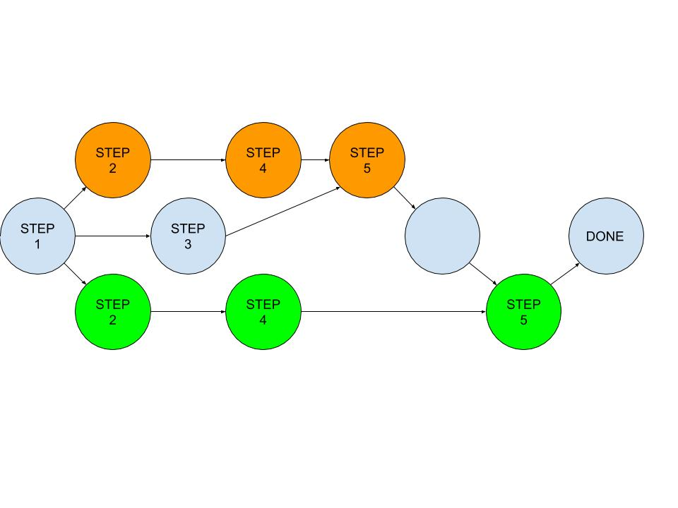

# Lab: Git Branches and Merges

## Introduction

Version control (managing and keeping track of who made what changes when) is essential
to all software development.  The earliest version control software simply recorded
the history of file changes and made it possible to designate check-points, and recreate the software as it was at any checkpoint.  Version control tools are now much more powerful
(and correspondingly more complex).  In this lab we will work with some of the more
advanced features of a modern distributed version control system.

Because we will be creating and reconciling diverging versions of files, this
lab will be much easier to do in pairs.

## Background

First and second generation (centralized) version control systems (e.g. the original Unix *Source Code Control System* and the more recent *Subversion*) tried to prevent multiple people from working on the same software at the same time.  This is far too restrictive for large software projects, and the rise of world-wide collaboration (e.g. Linux and Open Source software) gave birth to a new generation of (distributed) version control software.  *Git* is one of the best known and (through *github*) most widely used systems for distributed version control.

* In **centralized** version control, the key operations are *check-out* (lock the
  source code so that nobody else can change it) and *commit* (finalize my changes and un-lock
  the source code).
* Version control systems have long supported the notion of *branches*:
  parallel threads of independent development, starting from a common source).
  The creation of a new branch is called a *fork*, and bringing changes from
  a branch back into the main-line is called a *merge*.
* In **distributed** version control (where it is assumed that numerous people
  all over the world (or sitting next to each other in a lab) are working on
  the same software at the same time), the key operations
  are *rebase* (adjust my working copy to be based on a new starting point)
  and *merge* (combine my changes with those from others).
* As the *merge* and *rebase* operations have become more central, modern version
  control systems (like *Git*) have evolved to better guide developers through
  those processes.

##  Using the Git command line

Thus far, most of our *Git* use has been performed through *Eclipse*, which has given
us a GUI wrapper for importing new projects, committing our changes, and pushing those
changes back to a central repository.  This has mostly been very convenient ... except
for when we needed to make changes to files that were outside of *Eclipse* projects.

In this lab we will work directly with the underlying *git* commands (using the
Command Line Interfaces in terminal windows).  These commands should be usable on
most MacOS and Linux machines.  Students with Windows computers should install [git for windows](https://gitforwindows.org/) (specifically, the `Git BASH` tool will mimic the Unix experience) or just pair up with someone working on a Mac computer.

## Lab Exercises

**Note: [GitHub to replace 'master' with 'main'](https://www.zdnet.com/article/github-to-replace-master-with-main-starting-next-month/) October 1.** This lab still uses the term master, but it will eventually be updated to use main. For now, we've decided to leave the term as "master" because all other documentation for *git* will continue to use this terminology. We hope that the term "main" will become more common place so that we can scrub it from this lab description.

In this lab:

1. one team member will log into *github* and create a new public repo,
   clone that repo on their local machine, and create some initial content.
2. each team member will *clone* local copies and create new personal branches.
3. one team member will go back to the *master* branch, and make changes
   (that will not be reflected in the new branches).
4. each team member will, in their personal branches, create some
   new files, and make changes to one of the original files.
5. each team member will merge their personal branches back into
   the master branch.



### Git configuration

If you have not used the Git Command-Line-Interfaces before, it would be
helpful to do a little bit of initial setup.  From a terminal window
type the following commands:
   ```
   git config --global user.name "Your Name"
   git config --global user.email your_email@your_domain
   ```

When you do `git commit` command (without a **-m** argument), you will be put
into a text editor to see the files being committed and edit your comment.
If you have a preferred editor, you can set it with a command like:
   ```
   git config --global core.edior emacs
   ```
If you are not comfortable with any of the available editors, you
should always use the **-m** "*comment*" to create your commit
comments.

<!--
### Following Instructions Carefully

1. You will be graded based on your ability to create and merge
   conflicting updates.  I will look, not only at the text in
   the modified files, but at your commit history to see which
   steps were done in which order.  Make sure that all commit
   comments include:
   * the step you are working on (e.g. STEP 3, STEP 4, STEP 5)
   * who made the commit, of what updates, in what branch

2. If you make the STEP 3 changes before cloning your repos
   and creating your branches, you will not have a conflicting
   update in the master branch, and you will be unable to earn
   points for resolving that conflict.

3. The two team-mates should take turns doing their STEP 5
   merges of STEP 4 updates back into the *master* branch.
   If you attempt to do them in parallel, you will have to
   go through more pull/merge/push cycles.

 -->

### Step 1 - Repo creation

One team member should:

* log into *github.com*
* create a new repo:
   * click `Repositories` on the top menu bar
   * click the green `New` button
   * enter a name and description
   * check the `public` and `with README` options
   * click the green `Create repository` button
   * copy the returned URL and send it to your team mate
   * click `settings` and un-check the `Restrict editing to collaborators only` box.
* create a local clone (on a personal or lab machine)
   * start a Terminal window
   * `cd` to a directory where you want to do your work (e.g. your CSCI062 workspace).
   * make a local clone of the new repo, using the URL you copied, with a command like
     (obviously substituting in your github ID and repo name)
     ```
     git clone https://github.com/creators_github_id/your_new_repo.git
     cd your_new_repo
     ```
* create initial contents (in the cloned repo copy)
   * edit the `README.md` to identify the which lab this is and the names of your team members
   * create new files `file1.txt` and `file2.txt` with contents like:
     ```
     STEP 1:  created by YOUR_NAME on 11/06/19 at 14:05
     ```
   * commit your changes
     ```
     git add file1.txt file2.txt
     git commit README.md file1.txt file2.txt
     ```
     You will be put into an editor to enter a description of what you have
     done in this commit.
     **Include "STEP 1:" in your commit comments.
   * look at what you have done
     ```
     git status
     ```
   * push these changes back to the *master* branch on *github*
     ```
     git push
     ```
   At this point, if you go back to *github* and look at your repo,
   you should see these changes.

### Step 2 - Create personal branches

We will call these branches *person1* and *person2*.  You should use your
own personal branch names.

* For the person who already has a cloned copy of the repo:
  ```
  git checkout -b person1
  ```
* For the person who has not yet cloned their own copy
  ```
  git clone https://github.com/creators_github_id/your_new_repo.git
  cd your_new_repo
  git checkout -b person2
  ```

### Step 3 - Create conflicts by moving *master* beyond the new branches

After both personal branches have been created

* one team member goes back to the *master* branch
  ```
  git checkout master
  ```
* adds a new line to file1.txt ... with contents like
     ```
     STEP 3:  added by YOUR_NAME on 11/06/19 at 14:10
     ```
   * commit your changes
     ```
     git commit file1.txt
     ```
     And, again, enter a comment (including "STEP 3:") to describe
     the changes you have made.
   * push these changes back to github
     ```
     git push
     ```
* return to your personal branch
  ```
  git checkout *person1*
  ```

At this point, both of the new personal branches are behind master ...
giving rise to conflicts that will have to be reconciled in step 5.

### Step 4 - People do work in their own branches

Each person, working on their own machine, _in their own branch_ will:

* create a new file (e.g. *person1.txt*) containing a line like:
  ```
  STEP 4:  new file created by YOUR_NAME on 11/06/19 at 14:15
  ```
* add a new line to the pre-existing *file1.txt*, like
  ```
  STEP 4:  line added by YOUR_NAME on 11/06/19 at 14:16
  ```
* commit your changes
  ```
  git add person1.txt
  git commit file1.txt person1.txt
  ```
  And, again, enter a comment (including "STEP 4:") to describe the
  changes you have made.

* review the git log to confirm that all of these changes have infact
been made
  ```
  git log
  ```

Note that because your personal branches were created on your
personal machines, they do not (yet) exist on *github*, and so
you will not be able to `push` them back to *github*.

### Step 5 - Merge the (now conflicted) branches back into *master*

This is (at minimum) a two step process:

1. update personal branch to be based on the latest updates in *master* (which
   has been updated since this branch was created).
2. update *master* to include the (now consistent) updates from your branch.

Each person, working on their own machine, will, _in their own branch_:

* update their copy of the master branch (which they are not currently on)
  ```
  git pull origin master
  ```
  Because your branch is based on *master*, git will automatically check
  to see if *master* now contains updates that your branch does not ... which it does.
  Worse, *master* contains an update to a file that you have
  also changed, so git will insist that you must fix this confict manually.

* merge your updates to file1.txt with those in the *master* branch
  * edit the conflicted file1.txt and correctly organize the lines
    (from different versions) in chronological order
    (and deleting the notations about which text came from which version)
  * tell git you have resolved the conflict by re-adding the corrected version
     and committing (all of) the merge.
    ```
    git add file1.txt
    git commit -a
    ```
    The `commit -a` tells git that you want to commit *all* of the changes
    associated with this merge.  Include in your commit comment the notation
    "STEP 5: update my branch for changes in master".

  The first person to do this will only have to merge their changes against the line
  added to file1.txt in step 3.  The second person to do this will also have to merge
  with the changes made by the first person in step 5.

* now that your branch is up-todate with *master*, merge *your changes* back into the *master* branch
  (note: The command `git merge branch1` when executed in *master* will update
  *master* to include changes made to *branch1*).

  ```
  git checkout master
  git merge person1
  ```
  This time, because your (*person1*) branch is now up-to-date with respect
  to *master*, git should be able to automatically perform a fast-forward merge.
  If so, all you have to do is a *commit* and *push*.  But if there are other
  changes to be reconciled, you may have to resolve them as you did above.

* if you did not do *all* of these steps *in the correct order* you may find
  yourself instructed to do additional *pull* and *merge* operations.  If
  this happens, do the *pulls* (to update your local copies from recent
  pushes to *github* and additional *merges*.

* confirm that all of your work has now been checked in, and that you are fully up-to-date,
  and then push these updates back to *github*.
  ```
  git status
  git log
  git push
  ```

  The *status* command should show that you are up-to-date with respect to
  *master*, and that you have no uncommitted changes.

  The *log* command should show (in reverse chronological order):
  - the STEP 5 merge from person2
  - the STEP 5 merge from person1
  - the STEP 4 changes from person2
  - the STEP 4 changes from person1
  - the STEP 3 change to master
  - the original STEP 1 creation and contents additions

  If the person who created the repo on *github* does not correctly authorize
  pushes from un-registered collaborators, the other team-mate may find their
  pushes rejected.  The easiest way around this problem is, when prompted for
  a git-ID and password, have the person to greated the repo enter their ID
  and password.

### The `git` workflow

This is the usual workflow of `git`: you create a branch for working on a specific feature, commit (perhaps
several times) to that branch as you work on it, then eventually merge it back into the master branch, which
may take some manual fixing-up (but `git` does a lot for you). No matter how many people are working on
the same code, as long as they work mostly on different parts of it, they can all work separately this way,
and still synchronize their results periodically as branches merge together.
As a bonus, `git` keeps track of history for you, so it is unlikely that you will ever lose more work than
what you have done since the last time you ran `git` commit (for this reason, it is a good idea to commit
often). `git` stores all of its data in a hidden `.git` directory, so unless you wipe out that directory (and any
clones other people may have made) you will be able to recover your project.

<!--
## Grading

Your submission will be graded based on the the file contents and history
(including commit comments) in your *master* branch.  Each team should email
their instructor the URL for the (public) repo in which this work was done.


| Criterion                                   | Points |
| :------------------------------------------ | :----- |
| 1. repo created w/initial contents          | 1      |
| 2. creation of two personal branches        | 1      |
| 3. moving master past those branches        | 2      |
| 4. correct updates in personal branches     | 2      |
| 5. correct merging back into master         | 4      |
 -->
