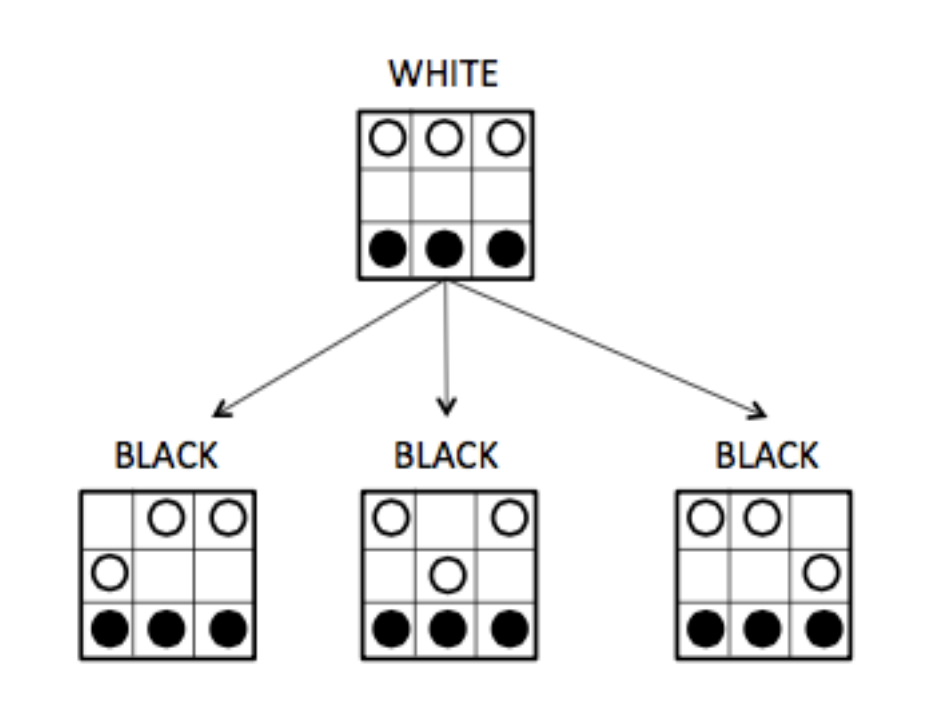

# Assignment 07 - Hex-a-Pawn

## Important Dates

* Release Date: March 26, 2019
* Due Date: April 2, 2019

## Objectives

For this assignment, you will:
* Gain experience working with tree data structures
* Gain more experience with recursive algorithms
* Implement a basic artificial intelligence algorithm for a two-player zero-sum game

## Description

This week's assignment uses trees to play a small chess-like game. You will build a tree representing
all possible states that the game board can be in. You will then implement several different players that
consult this tree to make moves as they play Hex-a-Pawn. The players include: a human player that asks
the user for moves to make; a random player that picks possible moves at random; and a computer player
that improves its strategy by learning from past mistakes. In the end, you will be able to run the different
players against each other.

Before starting this assignment, read Section 12.11 in Bailey's textbook. This section describes the Hex-a-Pawn
game as well as listing some steps to help you get started. This section also tells you that a complete game
tree for 3x3 boards has 252 nodes. In the margin where it states this, you will find some helpful debugging
advice (e.g., if your tree has 370 nodes then you have the wrong win test).

## Classes

In this assignment, you must implement a `GameTree` class as well as three different classes corresponding
to different types of players. Each of these player classes will implement the `Player` interface.

### `GameTree` 

You are responsible for designing the `GameTree` class. This is a tree structure with potentially many children
instead of just two. Think about the methods you will need for this class and how you can represent the
structure.

The picture below shows the top two levels (i.e. the nodes at depth 0 and 1) of the game tree that results
from a call to the constructor: 

    new GameTree(new HexBoard(3, 3), HexBoard.WHITE)

The root node of the tree contains the starting board position (`new HexBoard(3,3)`) and the player is
white (`HexBoard.WHITE`). Note that this is not a binary tree since it is possible for a node in the tree to
have multiple children each child corresponding to a legal action by the player.

### `Player` classes

You will construct three player classes: `HumanPlayer`, `RandPlayer`, and `CompPlayer`. Each player implements
the `Player` interface. This interface has only one method:

    public Player play(GameTree node, Player opponent);

The `play` method takes in a `GameTree` corresponding to some configuration of the board and the opponent
player. The return value of this method is the `Player` who won the game. Inside play, you should check if
the board configuration is a win for the opponent. If not, the player makes a move based on what type of
player it is. After making a move, you should then call the opponents play method.

You will have to think carefully about how the `Player` classes interact with the `GameTree` class this
should inform what methods and instance variables you include in the `GameTree` class. You can also create
a main method inside each `Player` class where you create two players and have them play a game this will
help you debug your code.

## Grading

You will be graded based on the following criteria:

| Criterion                                | Points |
| :--------------------------------------- | :----- |
| Efficient implementation of `GameTree` class | 3      |
| Correct `HumanPlayer`                       | 3     |
| Correct `RandPlayer`                       | 3     |
| Correct `CompPlayer` that trims tree over time                       | 3     |
| General Correctness                           | 3      |
| Appropriate comments + JavaDoc           | 2      |
| Style and Formatting                     | 2      |
| Extra Credit                              | 2 |

NOTE: Code that does not compile will not be accepted! Make sure that your code compiles before submitting it.

## Getting started

1. Follow the same steps with the first lab/assignment to clone the github repository for this assignment. 

2. The javadoc documentation for the classes can be found [here](http://www.cs.williams.edu/~freund/cs136-073/javadoc/hexapawn/index.html).

3. You can play a game of Hex-a-Pawn from the command-line by running the `HexBoard` class (that class
can compile on its own even though the `Player` class requires `GameTree` to be defined).

4. You can look at the `main` method in the `HexBoard` class to see an example of how to code up a game between two players.

## Extra credit
If you would like some extra credit, create a GUI version of the game that pops up a window, allows the
user to select the kind of opponent, displays nice graphics and allows the user to move by dragging pieces.