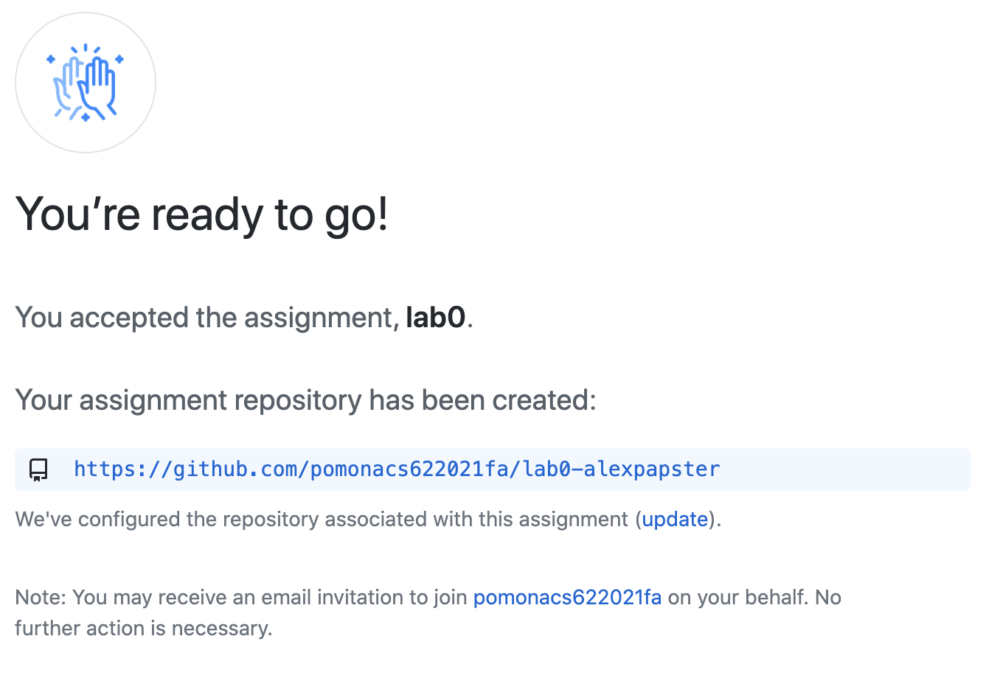
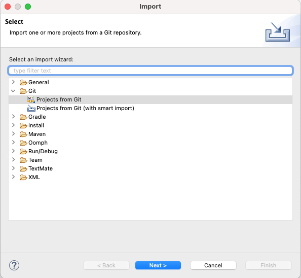
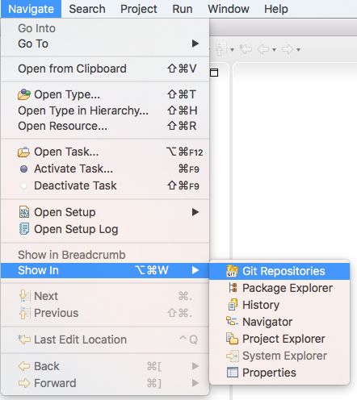

# Introduction to Java and Eclipse

## Learning Goals

* Install Java and Eclipse
* Introduction to Eclipse.
* Introduction to Github and assignment repos.
* Building and running simple Java programs.
* Project submission (committing changes and pushing them back to github.

## Key Terms and Concepts
* `Eclipse` - an [Integrated Development Environment](https://en.wikipedia.org/wiki/Integrated_development_environment) 
   that includes powerful tools for editing, running, and debugging programs. In this course we will be using it as a Java IDE.
* `Git` - a distributed [version control system](https://en.wikipedia.org/wiki/Version_control) 
   for tracking, coordinating, and exchanging file updates among groups of collaborating developers.
* `Github` - a web-based version control and collaboration platform for software
   developers, particularly popular for open-source projects and other shared
   code efforts.

## Overview
The goals of this assignment are to:
   1. Get slack setup for the course
   2. Install Java and Eclipse
   3. bring up Eclipse as an Integrated Development Environment.
   4. establish (if you do not already have one) a free personal
      [github account](https://help.github.com/en/articles/signing-up-for-a-new-github-account).
   5. import a clone of the master-copy for this project into Eclipse.
   6. fill in the missing code in a simple Java program.
   7. submit your work by committing and pushing it back to github.

## Classes

In this project you will be making simple changes to complete a program
that is comprised of two classes:

### `Token`
A `Token` is a virtual chip with a (randomly chosen) `color` and `value`.
   - It supports methods to `get` and `set` both the `color` and `value`.
   - It supports a `toString` method to enable it to be printed.
   - It also includes a `main` method that can be used (if this
     class is run as an application) to exercise this implementation.

### `Bag`
A `Bag` is a set of `Token`s, with several methods (all of whose implementations
require the enumeration of the `Token`s in the set).  It supports several
methods:
   - `firstToken` ... prints out the first `Token` in the `Bag`.
   - `allTokens` ... prints out all of the `Token`s in the `Bag`.
   - `allTokensWhile` ... the same as `allTokens`, but to be implemented as a while loop.
   - `addTokens` ... the sum of the values of all `Token`s in the `Bag`.
   - `highValueTokens` ... the number of high-value `Token`s in the `Bag`.
   - `firstGreen` ... the index of the first `green` `Token` in the `Bag`.
   - This class also has a `main` method that can be used to test the functionality of the other methods.

As provided, several of these methods are incomplete (and have **// TODO** comments explaining
what needs to be done). You are to fill in the missing code (mostly a few simple
assignments and loops) to complete all of the methods so that they work correctly.

## Signing up for slack

We're going to use slack for this class for asking questions outside of class, etc.  If you haven't used it before, it's a fairly standard posting platform that with a number of extra features that we won't heavily utilize for this class, but that you're welcome to play with.

### Sign up for slack

If you haven't used slack at Pomona before follow the instructoins at https://pomona.app.box.com/v/SlackDocuments/file/702470770217 to create a new account and add yourself to the student workspace.

### Message me on slack so I can add you to the CS62 channel

Once you've been approved as a student, message me on slack by typing @David Kauchak followed by some message.  I'll then add you to the CS62 channel for this course.  Note that it can take ITS a little while to approve your addition to the student workspace, so feel free to move on to the rest of the lab while you wait.

## Installing Java and Eclipse

1. Install the Java JDK (Java Development Kit), version 1.8 ("Java 8")

   - Go to https://java.com/en/download/ and click the "Java Download" button
   - You should see your system (seen in red "Download Java for ...") and you should also see "Recommended Version 8 Update ..."
   - Click "Agree and Start Free Download"
   - Once downloaded open/run the file and follow instructions to install Java.
   
   If this doesn't work, go to https://www.java.com/en/download/manual.jsp and select your operating system manually.
   
2. Install the Eclipse IDE
   
   - Go to https://www.eclipse.org/downloads/
   - Click the orange "Download 64-Bit" button.  This should take you to a page specific for your operating system.
   - Click the "Download" button.
   - When the download is complete, run the application.  This is the Eclipse installer which will help you install Eclipse.
   - When the application runs, you'll see a number of different versions of Eclipse that you can install.  **Select "Eclipse IDE for Java Developers"**.  It should be the first one.
   - Follow the instructions of the installer selecting all of the default options.
   
3. Running Eclipse
   - When the installation finishes, there should be a green button to "Launch" Eclipse.  Click on it.  (In the future, you'll need to search for Eclipse as an application and then run it.  I'll let you configure your own machine however makes the most sense for you."
   - When Eclipse first starts, it will ask you to enter the workspace location:
   
   
   
   - Click the "Browse..." button and browse to your Desktop, **but don't click open yet**
   - Create a new folder called cs062_workspace within the browse window (this will be something specific to your operating system).
   - Select this folder and then click open.
   - Your Eclipse launcher should now have a workspace folder selected that ends in "CS062_workspace" (the rest of the path will be different depending on your computer setup:
   
   
   
   - Click "Launch"
  

## Importing the Assignment

1. If you do not already have a github account, go to github.com and
   [register a new personal user account](https://help.github.com/en/articles/signing-up-for-a-new-github-account).

2. You will receive an email invitation to join each lab.  Follow that
   URL and you should see a message like:

   
   
   Once you accept the invitation, you will be provided with a unique URL for
   your (private) version of this project.  Click it.

   

   You will see a unique copy of your lab repository. Click on the green `Clone or download` button and copy the returned
   HTTPS URL:

   

3. Start Eclipse on your computer (if you don't already have it open and running).  It will ask you to choose
   a workspace. You should browse to the workspace folder that you 
   created above. Eclipse will remember this selection
   and prompt it as a default (or in the list of Recent Workspaces)
   when you start Eclipse in the future.

4. Import your new github repo onto the machine where you are working.
  
  Click on `File`->`Import` and follow the windows below: 
   
   

   

5. Paste the URL you copied from Github. It will automatically populate 
   the fields. 
   Add your Github username and password. 
   Make sure to check `Store in Secure Store` unless you want to re-enter your 
   credentials every time you interact with the repository. 
   Feel free to add a password hint if you consider it necessary, once prompted. 
   (**Note:** If you have two-factor authentication enabled for your Github account, 
   you will need to disable it prior to entering your credentials here)

6. You'll see a screen with "master" checked.  Click "Next".

7. **Carefully** browse to the destination which needs to be your workspace that you created on your Desktop. 

8. Follow the following screens to complete cloning.

9. You should now be able to see your newly-cloned starter code. 

## Your first coding project ##

Edit the `Token.java` and `Bag.java` files to add the missing code (which is indicated by **// TODO** comments).  If you are not yet sure how to code a particular type of statement (e.g., a Java `for` loop), Google for examples or ask the instructor and the TAs for assistance.

If your program contains any obvious syntax errors, Eclipse will give you red warning indications on the affected lines of code.  If the errors are distributed over multiple modules you can see all of them by selecting the `Problems` tab in the bottom part of the Eclipse window.
   
If you want to try compiling and running one of your programs:

   - select (in the *Package Explorer* on the left) the module you want to compile and run.
   - select the `Run` item from the top menu bar.
   - the output from your program should appear in the `Console` tab of the bottom part of the Eclipse window.

You should fill in the missing code in `Token.java` first because  `Bag.java` depends on `Token.java`. When you start building `Token.java` you will be warned that there are still errors in the project (because
   you have not yet fixed `Bag.java`). You can safely ignore this warning.

## Submitting your work

*Commit* your changes and *Push* them back to Github.
   
   Enable the Git Repositories view:

   

   Right click on the repository and then click `Commit`.

   

   Transfer all your files from `Unstaged Changes` to `Staged Changes`. 
   If you don't see options for `Unstaged Changes` and `Staged Changes`, 
   click `Open Git Staging View` in the bottom left-hand corner or the 
   `Git Staging` tab in the bottom window.

   You should see a list of *Unstaged Changes* 
   (changes you have made but not yet *committed*).  
   If you highlight one (or more) of those files you can
   add a commit message (describing the changes you have made) and then
   click the `Commit` button.  
   You can make as many *commits* as you like.
   It is common to do different *commits* for different sets of changes.
   Provide a meaningful description of each commit.

   These changes will only be on your local machine until you do a *Push* back
   to the [origin](https://www.git-tower.com/learn/git/glossary/origin) on github.

   

   When you click the `Push` (or `Commit and Push`) button, all committed
   changes will be pushed back to Github ... at which they will be saved
   and visible to us.  We will notice and grade your last on-time *commit*.

   If you want to confirm that we can see your work, go to the URL that you were given 
   on github. You should see the latest commit you pushed.

   Submitting correctly is your responsibility, and if you forget to submit or 
   submit unsuccessfully without following up, everyone will be unhappy. 

   **Important:** For assignments, the last commit you push by the due date is the one we will look at and grade.

## Helpful Considerations

* Saving your work - Make sure to commit and push your work to GitHub MULTIPLE TIMES throughout the process! Not only does this help us see your unique progress, but it ensures that you have frequent backups of your work.
**AVOID** one big push at the end of your work.   
We want to be able to see the progressive development process that you followed.

## Wrapping up
When you're all done, make sure that you've pushed the latest version of your code via git.  Labs are participation based, so make sure that you've pushed something by the end of the lab.
