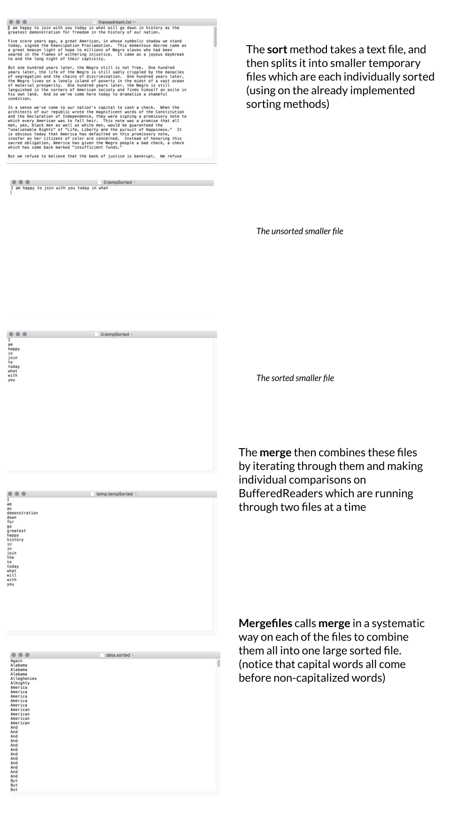

# OnDisk Sort

## Key Terms and Concepts

* File I/O - Methods for handling input (I) and output (O) to different files. Allows us to read and modify various files through different systems. (See lecture 6 slides, **Apendix A - File I/O in Java**, and these two tutorials [1](https://docs.oracle.com/javase/tutorial/essential/io/)[2](https://www.tutorialspoint.com/java/java_files_io.htm) for more).
* Mergesort - A divide and conquer algorithm for sorting arrays of n elements in O(n log n) time. The data to be sorted are split into smaller chunks, sorted, and then merged back together by doing simple comparisons while iterating through the smaller sorted sets (See lecture slides and  2.2 pg. 270 - 277 in the textbook for more). Typical implementations of mergesort are not in place and often the data cannot be loaded in memory. 
* Iterator - An interface that allows traversal through a collection based on some property. Requires the `hasNext()` (which checks if there is another element left) and `next()` (which returns the next element) methods (See lecture notes, 1.1 pg. 100 and various other examples in the textbook and [here](https://docs.oracle.com/javase/8/docs/api/java/util/Iterator.html) for more)

## Learning Goals

* Practice reading from and writing to files.
* Practice using Java exceptions and try/catch statements.
* Practice using an Iterator to iterate over a collection of Strings.
* Implement a divide-and-conquer algorithm that uses a smart trick to tackle memory requirements.

## Description

For this assignment, you will be implementing an on-disk sorting algorithm that is designed to use the
disk efficiently to sort large data sets.
All of the sorting algorithms we have looked at so far assume that the data is in memory and that we can swap
data elements efficiently. Sometimes, because of the size of the data you cannot fit all of it in memory. In
these situations, many of the traditional sorting algorithms fail miserably; the algorithms do not preserve
data locality and end up accessing the disk frequently, resulting in very slow running times.

Your algorithm will work in two phases:

* First, your sorting algorithm breaks the data into reasonably-sized chunks and sorts each of these
individual chunks. This is accomplished by reading a chunk of data, sorting it, writing it to a file, then
reading more data, etc. At the end of this phase, you will have a number of files on disk that are all
sorted.

* Second, you will need to merge all of these files into one large file. This is accomplished by pair-wise
merging of the files (very similar to the merge phase of mergesort) and then writing out the result to a new,
larger merged file. Eventually, all of the files will be merged to one large file. Note, this can be done
very memory efficiently.

*The correctness of the assignments in this class will be automatically verified. For this reason, you must
follow all naming conventions specified in this assignment.*

## Classes

### `MergeSort`
Implementation of the Mergesort algorithm. This class has already been implemented for you.
### `QuickSort`
Implementation of the Quicksort algorithm. This class has already been implemented for you.
### `Sorter`
An interface for sorting algorithms. Implemented by the `MergeSort` and `Quicksort`classes.
### `WordScanner`
Implements the Java `Iterator` interface. An iterator over Strings read in from file. This class has already been implemented for you.

### `OnDiskSort`

We have provided you with a skeleton `OnDiskSort` class that you will need to fill in the details for. We encourage you to add additional private methods, but, as always, do not change the names or parameters of the methods we have provided you. This will make our life much easier when we grade
the assignment. As an aside, we have made some of the methods protected where normally we would have made them private to, again, assist us in grading.

You will need to fill in the following methods:

* `OnDiskSort`: the constructor for the class. Make sure that you understand what all of the parameters do. `maxSize` is the maximum number of Strings that can be read in to memory at any one time. You will need to create temporary files along the way (for example, to store the sorted chunks). This should be done in the `sorting_run` directory (which is also just a `File`). We suggest you name the
temporary files something simple like `0.tempfile`, `1.tempfile`, etc.
Make sure you clear the working directory when you're done. `sorter` is the sorter that you should use
to sort each chunk. `outputFile` will contain the final result of your sorting.

* `sort`: this is the public method that will be called when you want to sort new data. For this assignment,
we will only be sorting String data (notice that `WordScanner` is an `Iterator<String>`). This method
will read in the data, `maxSize` words at a time, sort each chunk using the sorter, store the sorted chunk in a temporary file, and then put the file into an arraylist of files. Once all of the data has been read
in, you will have an arraylist of files, each of which is sorted. You should then call the `mergeFiles` method to merge all the sorted files.

* `merge`: takes two sorted files and merge them into one sorted file. This is very similar to the `merge`
method of MergeSort. The main difference is that rather than merging from two arrays (or ArrayLists) you are merging two files. You **should not simply read in the data from both of these files
and then use the merge method from MergeSort**. We are trying to be memory efficient and this would defeat the purpose. Instead, you should open `BufferedReader`s to both of the files and
then, reading one line at a time, read either from the first file or the second, and write that directly
out to the output file, depending on the appropriate ordering. Besides the variables for doing the file
I/0, you should only need **two** String variables to keep track of the data.

* `mergeFiles`: takes an ArrayList of Files, each of which should contain sorted data and then uses the merge method below to eventually merge them into one large sorted file. Notice that the merge method only merges two files at a time. The easiest way to merge all of the `n` sorted files is to merge the first two files, then merge the third file with the result of merging the first two files, then the fourth
in, etc. This is *not* the most efficient way of doing it. However, it will make your life easy (see the
extra credit for doing it a better way). NOTE: you cannot read and write to a file at the same time,
so you will need to use another temporary file to store your temporary results as you merge the data.

* `main`: This method gets everything going and is provided to you. It creates a `sorter` that does a mergesort
in memory, then creates a `diskSorter` to do the external merges. Parameters to the `OnDiskSort` sets up directory sorting run to be the working directory for the sorts. It then creates a word scanner
to read King’s "I have a dream" speech. Finally it calls the `sort` method of `diskSorter` with the scanner to input all the words of the speech, sorts them, and puts them in the file `data.sorted`.

To assist you, we have also provided a few helper methods in the `OnDiskSort` class that you may find
useful. They primarily do some simple operations with files. If there is any confusion about what these
methods do, please come talk to us. In addition, these helper methods may also help you understand basic
Java file I/O. For more on file I/O, you can also see **Appendix A - File I/O in Java**

## Getting started

1. Follow the same steps with the first lab/assignment to clone the github repository for this assignment.

2. You will also need a directory in which to put the files to be sorted. We suggest you create a directory called `sorting_run` in your project directory. In that directory put a file containing a copy of King's
“I have a dream” speech. It is in a file named "Ihaveadream.txt" and is in with files from last week’s assignment. Be sure to name these exactly as given here, and make sure the directory `sorting_run` is
in the same directory as the `src` and `bin` directories. (If not, then the program won’t find them
and it will crash!) See the main method of `OnDiskSort` for the names. Note that we may test your
code using a different directory for temporary files, so your code shouldnt use the name sorting run
except in its main method as a default value.

3. See **Appendix A - File I/O in Java** and **Appendix B - The file system** for some background on the project.

4. Start working on the methods in `OnDiskSort`. Try to understand how they each fit together before beginning work on them. My recommended order for the methods is the one presented in the **Classes** section, though you can jump around and work on various other pieces if you are stuck on one method.

## Grading

You will be graded based on the following criteria:

| Criterion                                           | Points |
| :-------------------------------------------------- | :----- |
| `Merge`                                             | 3      |
| `MergeFiles`                                        | 3      |
| `Sort`                                              | 3      |
| Uses on 2 strings in `merge`                        | 2      |
| Cleans up temporary files appropriately             | 2      |
| General Correctness                                 | 2      |
| Appropriate comments (including JavaDoc)            | 3      |
| Style and Formatting                                | 2      |
| Submitted correctly                                 | 1      |
| **Total**                                           | **21** |
| Extra Credit                                        | 2      |

NOTE: Code that does not compile will not be accepted! Make sure that your code compiles before submitting it.

## Submitting your work

 Double-check that your work is indeed pushed in Github! It is your responsibility to ensure that you do so before the deadline. Don't forget to commit and push your changes as you go and to edit the provided `json`. The code you submit should be your own.

## Extra credit

As we mentioned above, this is not an efficient way to merge all of the sorted chunks. Once you have
things working above, for extra credit, implement a more efficient `mergeFiles` method by merging pairs of
files of the same size. That is, if you start with `n` files of size `k`, merge them in pairs to obtain `n/2` files of
size `2*k`. Then merge those together in pairs to get `n/2` files of size `4*k`. Continue until they are all merged.
This is optional and you do not have to do it!
If you do this, we strongly suggest making a new method (i.e. don’t delete your original `mergeFiles`
method, just rename is to something like `mergeFilesLinear`).

### Appendix A - File I/O in Java:

For those that haven't had any file I/O experience in Java, we’ll give a brief intro here, but also take a look at the streams cheat sheet available off of the course Documentation page. You can also look
up information about the classes seen in the code and discussed here via the Java libraries link there. For most I/O, you’ll need to `import java.io.*`.
The two main classes you’ll be concerned with when doing file I/O in java are `BufferedReader` for
reading data and `PrintWriter` for writing data. To read data, you can create a new reader by:

    BufferedReader in = new BufferedReader(new FileReader(...))

where `...` can be either replaced with a `String` or can be replaced with a `File` object.

To write data, you can create a new writer by:

    PrinterWriter out = new PrintWriter(new FileOutputStream(...))

In both cases, you will need to surround these with a try-catch to handle the `IOException`.

### Appendix B - The file system

The file system on these computers starts at the very base directory of `/`. Everything is then expanded
out based on directories. For example `/home/apapoutsaki/` is two directories starting from the base, first
`home` then `apapoutsaki`. The `/` is called the file separator and is different depending on the operating
system (e.g. it’s `\` on windows computers). Filenames can be specified as *relative* filenames, where
they are relative to the current location of the program (or user). Relative filenames do NOT start
with a `/`. It can be confusing telling exactly where your program currently is when running it, so
often the best approach when writing programs is to use a full path which starts at the base directory.
(Don’t do that this time because we want the program you turn in to work when copied to the TA’s
directory!) If you ever want to know where you are when you’re in the `Terminal`, the `pwd` command
(for *print working directory*). You can try it out by just typing `pwd` and hitting return (though that
won’t work in `Eclipse` – you must be in the `Terminal`)!.
Rather than hard-coding in a file or directory, you can also pop up a dialog box and let the user choose
the file. 
