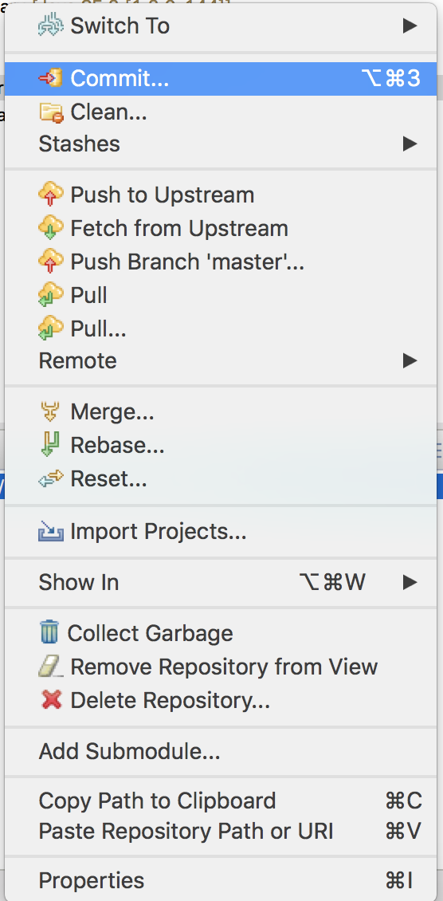
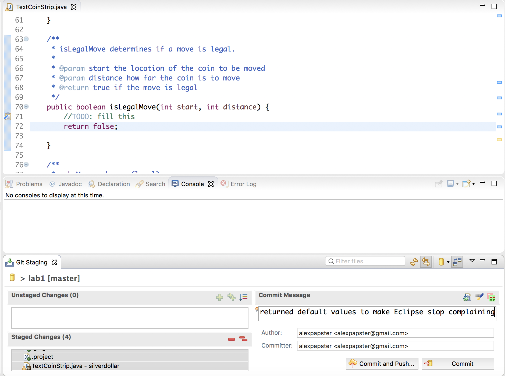

# Lab 1 - The Silver Dollar Game

## Learning Goals

* Practice some of your new Java programming skills.
* Play with using the `ArrayList` class.
* Gain experience testing for errors and writing code that handles edge cases.

## Key Terms and Concepts
* `ArrayList` - An ArrayList is a resizable array-like data structure, where items can be added and removed regardless of the initialized size (See 1.3 pg. 136 in the textbook and the lecture notes). In this lab we will use the default java.util.ArrayList class. Please look into its [documentation](https://docs.oracle.com/javase/8/docs/api/java/util/ArrayList.html) for more details about its methods.
* Edge cases - A possible scenario of user input which requires a specific or non-standard response from the code, such as a user clicking out of bounds or attempting an illegal move.


## Silver Dollar Game

Clone and import this project as you did with the introductory assignment. Your program for lab today is to write a text-based version of the Silver Dollar Game. See **Appendix A - Rules** for more information on the specifics of the game. Make sure you understand how the game is played
before coding it up! This is a time for discussion in the lab; do not hesitate to ask questions or share
your thoughts.

The behavior, in the console, will look like this:

```
_o____oo_oo_ Next move? 6 4
_oo____o_oo_ Next move? 2 2
Illegal move!
_oo____o_oo_ Next move? 1 1
o_o____o_oo_ Next move?
...
ooooo_______ You win!!
```
The pair of numbers after `Next move?` signifies the location of a coin and the number of squares
that the coin is to move to the left. To be consistent with how we do indexing in Java the leftmost square is location 0, not 1.

For this first exercise, we have given you a start on the code for the class `TextCoinStrip`. Take some time to understand the code (I promise you’ll be much better off spending 5-10 minutes
looking at the code before doing any coding yourself), then fill in the four missing methods.

1. `toString` which creates the string representation of the strip,
2. `isLegalMove` which determines if a move is legal,
3. `makeMove` which makes a (legal) move, and
4. `gameIsOver` which determines if the game is completed.

Note that the program will not execute at all until `gameIsOver` compiles successfully.
We suggest that you change it to return `false` until you get the other functions working.

## Hints/Advice
* Develop incrementally.  Write one method and test that it works by writing static test methods (either in the class or in a separate class).  Make sure that method is working as you expect before moving on to the next method.  To get in good habits, you should also be pushing your changes to github once you have one method working.
* Think about all of the possible ways that your methods could be called and make sure that you are handling all of the cases appropriately.  One of the goals of this class is to get used to testing your own code in more realistic settings, i.e., where the inputs might not always be "proper" inputs.
* There are many constraints on whether or not a move (starting point and distance) is
legal.  You should think about these and enumerate them (in the pre-method comment) before
trying to write the code for the `isLegalMove` method.

## Extension

This is a suggestion for those who want to go beyond today’s exercise; it is not a course
requirement. Let the computer assume the role of one player and experiment with strategies for the
Silver Dollar Game. You may conduct your experiments in either the text-based or the graphical world.
Here are some simple strategies:
* Move the leftmost possible coin as far as possible.
* Move the rightmost possible coin one square.
* Find a coin capable of moving the farthest and move it the full distance.
* A “gap” is a sequence of unoccupied squares between two coins. If possible, make a move to
increase the number of gaps.

## Submitting your work

Make sure that you change the `@author` comment at the start of each file to include your own name.

Although we will not get into the details of Github in this lab, it is important to know that you have on your side a powerful tool that keep track of your work along the way and save you from a lot of trouble.

Every time you feel that you have completed a substantial or logical part of your program, you should consider committing and pushing your work. This will also allow us to monitor your progress. **AVOID** one big push at the end of your work. This will make us suspicious about your work. For example, after writing the `toString` method in this lab you might want to commit your work. 

Right click on the repository and then click `Commit`.



Transfer all your files from `Unstaged Changes` to `Staged Changes`. If you don't see options for `Unstaged Changes` and `Staged Changes`, click `Open Git Staging View` in the bottom left-hand corner.

Write a meaningful message. For example, since I returned default values for the methods you have to fill so that Eclipse would stop complaining:



Click `Commit and Push`

Want to confirm that we can see your work? Go to the URL that you were given. You can see the latest commit you pushed.

Make sure you edit the `.json` file you are given with every lab/assignment to include your username, your partner's username (if collaboration is allowed), and indicate if you did any extra credit work.

Submitting correctly is your responsibility, and if you forget to submit or submit unsuccessfully without
following up, everyone will be unhappy. Make sure you commit and push regularly so that we can see your progress and you avoid losing your work. 

**Important:** The last commit you push by the due date is the one we will look at and grade.

## Grading

This lab will directly lead into the assignment, so I'd strongly encourage you to complete the lab.  For grading purposes, you need to:

1. Participate in lab discussions.
2. Push some code by the end of lab that compiles and shows some progress.

### Appendix A - Rules

In the silver dollar game, your objective is to move all the coins to the left side. Coins can be moved multiple squares at a time, and only to the left. Coins cannot jump over each other, nor can they occupy the same square as another coin. The coins start in random positions along the strip.

The game is over when all the coins are next to each other starting in the far left square.
